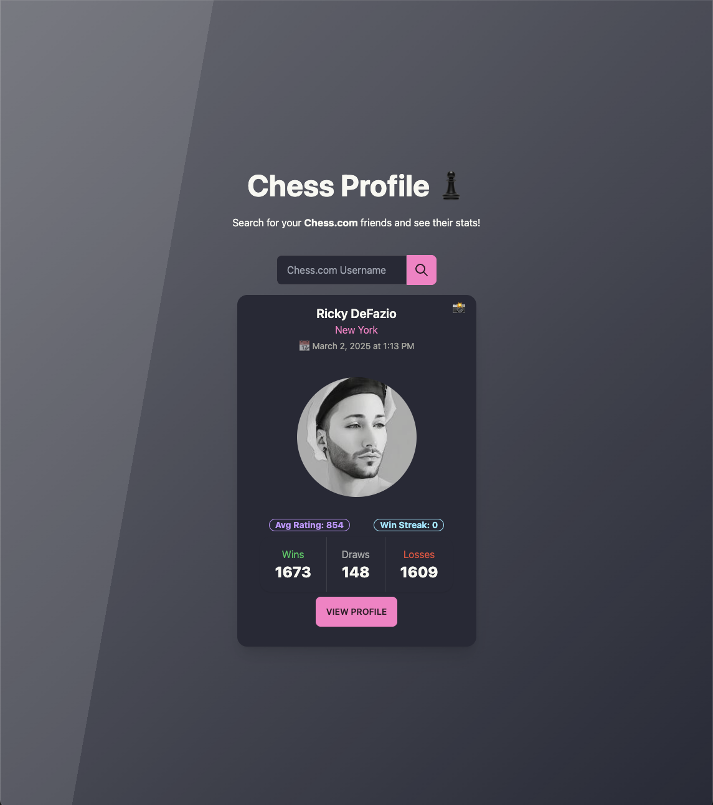

# Chess Profile

A modern web application for viewing and analyzing Chess.com player statistics with an elegant UI and efficient caching system.



## Overview

Chess Profile is a Next.js application that allows users to search for Chess.com players and view their statistics in a beautifully designed interface. The application provides detailed insights into a player's performance, including:

- Current rating across different game types
- Win/loss/draw statistics
- Current win streak
- Visual representation of performance metrics

## Architecture

The application follows a clean, layered architecture:

- **Client**: React components that handle the user interface and interactions
- **Database**: Firebase Firestore to store player data
- **Internal API**: Next.js API routes that handle authentication and data processing
- **External API**: Chess.com's public API for player data

## Key Features

- **Real-time statistics**: Fetch the latest player data from Chess.com
- **Data Storage**: Firebase Firestore to store player data
- **Responsive design**: Beautiful UI that works on desktop and mobile
- **Error handling**: Graceful handling of API failures with retry mechanisms
- **Authentication**: API key protection for internal endpoints
- **Win streak calculation**: Specialized algorithm to determine current win streaks

## Technologies Used

- **Frontend**: React, TypeScript, TailwindCSS
- **Backend**: Next.js API Routes
- **Database**: Firebase Firestore
- **Data Fetching**: Fetch API with retry mechanism
- **Date/Time Handling**: Luxon
- **Deployment**: Vercel (or your deployment platform)

## Getting Started

### Prerequisites

- Node.js 14.x or higher
- npm or yarn

### Installation

1. Clone the repository:

```bash
git clone https://github.com/yourusername/chess-profile.git
cd chess-profile
```

2. Install dependencies:

```bash
npm install
# or
yarn install
```

3. Create a `.env.local` file in the root directory with the following:

```
NEXT_PUBLIC_API_KEY=your_generated_api_key
```

4. Start the development server:

```bash
npm run dev
# or
yarn dev
```

5. Open [http://localhost:3000](http://localhost:3000) in your browser.

## Usage

1. Enter a valid Chess.com username in the search box
2. View detailed statistics about the player
3. Click on specific metrics to see additional details

## Code Structure

- `/src/components`: UI components
- `/src/pages`: Next.js pages and API routes
- `/src/utils`: Utility functions for data processing
- `/src/middlewares`: API middleware (authentication)
- `/src/types.ts`: TypeScript type definitions

## Performance Optimizations

- **Caching**: Responses are cached in Firebase Firestore for 1 hour
- **Retry Mechanism**: API calls use exponential backoff for reliability
- **Minimal Dependencies**: Lightweight dependency footprint

## Future Improvements

- Add historical performance tracking over time
- Add comparative analysis between players

## License

[MIT](LICENSE)

## Author

[Ricky DeFazio](https://rickydefazio.github.io/)

---

Feel free to reach out with any questions or improvements!
